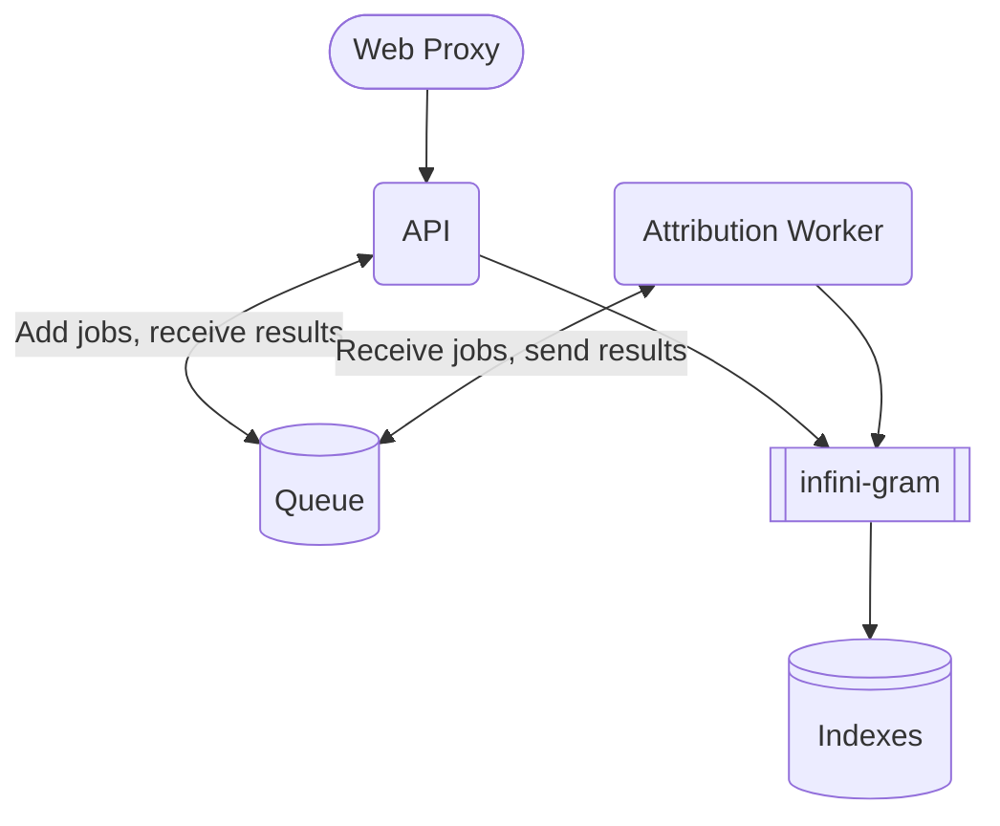

# Infini-gram API

This API is a wrapper over [infini-gram](https://infini-gram.io) to allow it to be used through an API at scale. It's a uv workspace with two applications ([the API](./api/README.md) and [the worker](./attribution_worker/README.md)) and one library to share code between the two ([infini-gram-processor](./packages/infini-gram-processor/README.md)).

## Reference
This application is only made possible by researchers that worked on the infini-gram paper:
  Liu, Jiacheng and Min, Sewon and Zettlemoyer, Luke and Choi, Yejin and Hajishirzi, Hannaneh (2024).
  Infini-gram: Scaling Unbounded n-gram Language Models to a Trillion Tokens.
  arXiv preprint arXiv:2401.17377,

## Getting Started
To develop in this repo, see the [contributing doc](./docs/CONTRIBUTING.md).

## Indexes
You can find the index documentation [here](./docs/indexes).

## Architecture

This application is deployed on Ai2's [Skiff](https://skiff.allenai.org/) platform. It's a wrapper over k8s designed to streamline development and deployment.

The API and worker are in different deployments and are separately scalable.

Both the API and worker access infini-gram and the associated indexes. The API will pass any `attribution` requests to the queue and await the result. The worker reads requests from the queue and works them, returning the result to the queue when finished. Requests other than `attribution` will be handled in the API. `attribution` requests are split off because they take much longer, which was causing the server to hang under load.

